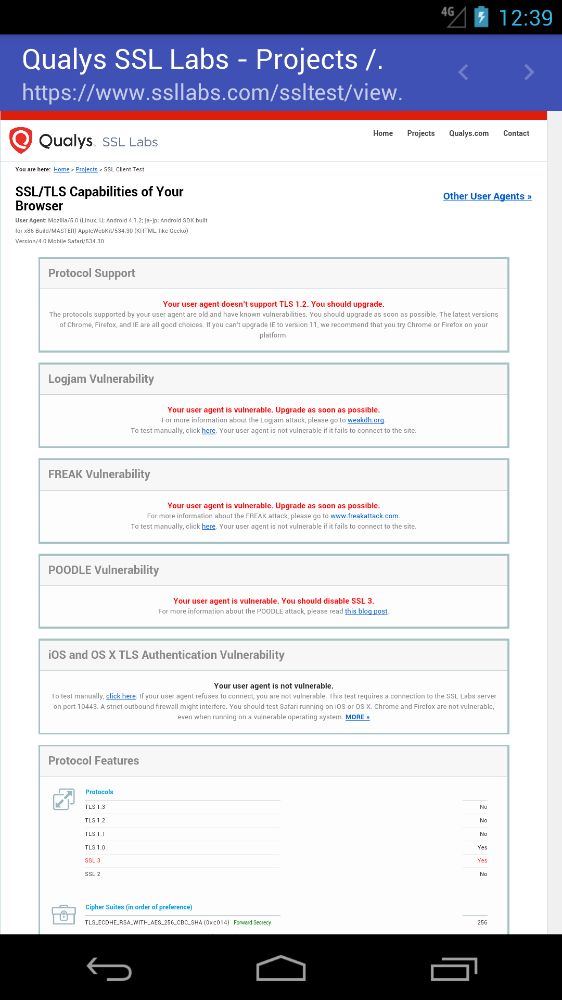

# TlsSupportedWebView

## What is this?

This is a test implementation that enables TSL 1.2 in WebView of Android 4.1 - 4.3.

## Screenshots

|before|after|
|--|--|
|||

## Author
大前 良介 (OHMAE Ryosuke)
http://www.mm2d.net/

## License
[MIT License](./LICENSE)
